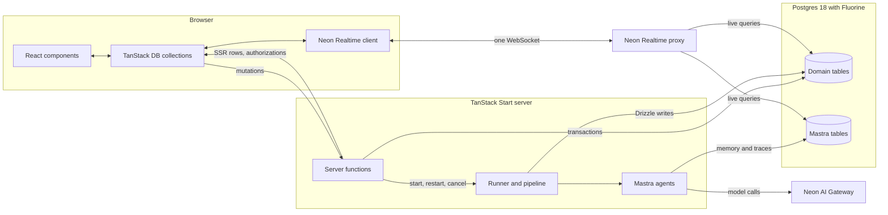

# Livebase

Livebase is a small, AI-native CRM and sales pipeline built with Neon Realtime and Mastra.

It demonstrates how to build a modern AI-enabled app on the Neon platform, with users and agents working on the same data in realtime. You paste whatever you have about a lead, such as an email address, a LinkedIn URL, or a paragraph of notes. Agents turn it into structured records that appear in realtime as they're written.

The example shows:

- users and agents changing the same rows at the same time, with every change reaching every open window through Neon Realtime.
- Mastra embedded in the TanStack Start server, with its memory and traces stored in the same Postgres database and synced to the browser as the agent activity view
- live queries that the server authorizes for the caller's workspace
- optimistic user edits that Neon Realtime confirms by transaction ID
- model calls through the Neon AI Gateway

Open the app in two windows and paste a lead. The new row appears in both windows at once and fills in as the extraction agent works. The enrichment agent then researches the company and the person, and the logo, company details, avatar, and colleagues appear one by one. The lead's activity panel shows each agent run as it happens. Change the lead's stage in one window and the other follows.

As well as Neon Realtime and Mastra, the stack uses the Neon AI Gateway, TanStack (Start + DB), Drizzle and an (optional) set of data enrichment services.

## Pre-requisites

- Node.js 24 or newer
- Neon project with [Neon Realtime]() and [Neon AI Gateway]() enabled
- the project's AI Gateway base URL and token.
- optionally, keys for the enrichment services (see [Enrichment keys](#enrichment-keys)); enrichment runs without them, just with
  fewer tools and thus less success

## Environment variables

Copy the example environment file:

```sh
cp .env.example .env
```

In `.env`, set the required vars:

- `DATABASE_URL` your Neon Postgres connection string
- `NEON_REALTIME_SECRET` and `NEON_REALTIME_URL` your Neon Realtime config
- `NEON_AI_GATEWAY_BASE_URL` and `NEON_AI_GATEWAY_TOKEN` your Neon AI Gateway config

And the optional enrichment keys:

- `EXA_API_KEY`
- `X_BEARER_TOKEN`
- `GRAVATAR_API_KEY`
- `VITE_BRANDFETCH_CLIENT_ID`

## Run the app

Install the dependencies:

```sh
npm install
```

Run the migrations to create the domain tables, initialize Mastra's storage and seed the demo workspace:

```sh
npm run db:setup
```

Run the app:

```shell
npm run dev
```

Open http://localhost:5173 one or more browser tabs.

## Enrichment

Once extraction has written the lead, its person, and its company, an enrichment agent researches them in the background. It runs as one Mastra agent call per lead and records each fact as soon as it finds it, so the lead fills in live.

### Enrichment keys

Every enrichment key is optional. A tool whose key is missing isn't registered, so the agent works with the tools it has.

| Variable | Enables | Without it |
| --- | --- | --- |
| None | `readWebPage`, `wikidataLookup`, `checkDomain`, `findCompanyWebsite`, `lookupGravatar` (public avatar only), `recordFinding`, `recordColleague` | — |
| `EXA_API_KEY` | `webSearch`, through Exa search. It finds the employer for leads that give only a name and a LinkedIn URL, and fills gaps such as funding and recent news. | A lead that gives only a person's name rarely gets a company. |
| `X_BEARER_TOKEN` | `lookupXProfile`, for avatars from X. The token's tier must allow user lookup by username. X may bill each lookup; a run makes at most 4. | No X avatars. |
| `GRAVATAR_API_KEY` | The full Gravatar profile in `lookupGravatar`: the display name, job title, company, and verified accounts such as an X handle. | `lookupGravatar` checks only the public avatar URL. |
| `VITE_BRANDFETCH_CLIENT_ID` | Brandfetch logos, loaded in the browser. It's a public client ID, so it's safe to expose. | Logos come from the agent's `logo_url`, then a favicon service. |

The other keys stay on the server. `lookupGravatar` is registered only when the lead has an email address.

### How a run works

The agent works in this order:

1. **Company.** It takes the domain from a corporate email address or a URL in the input. Otherwise `findCompanyWebsite` finds the company's site from its name, or, for a name and a LinkedIn URL, a web search finds the employer first. Recording the domain makes the logo appear, so the agent records it in the step right after it learns it.
2. **Company facts** from the homepage, the about page, and Wikidata.
3. **The person** on the company's own site: their title, seniority, public profiles (their own site, X, or GitHub, but not a Gravatar profile page), and avatar. Avatars come from Gravatar, then X, then a headshot on the company's site, then GitHub. Each is checked to be an image at least 64 px across, and an X handle counts only when a source ties it to the person, never when it's guessed from a name.
4. **Up to 6 current colleagues**, with titles, from the same team page. When `readWebPage` looks for the person on a page, it also lists the photos that name other people (`otherPeopleImages`), so colleagues get photos from the same read. If the page that names the person lists nobody else, the agent looks once more, with one search or one team-page read.
5. **Gaps**, such as funding and recent news, from web search. The run's message gives today's date and the cutoff for recent news, a year back.
6. **A fit score and next step**, then a one-line summary.

The agent records a few facts at a time, each in the step after the tool result that gave it and alongside its next research calls, so the record fills in steadily rather than in one late batch. Facts the input states go in its first step.

Mastra retries a failed model call, such as a rate limit (HTTP 429), without running any tool again. Enrichment retries up to 4 times and extraction up to 2. Mastra waits for the gateway's `Retry-After`, up to 30 s, or otherwise backs off 1 s, then 2, 4, and 8 s. If the call still fails, the lead fails with the gateway's reason in its detail. The runner logs the failure as one line with the error's name, message, and HTTP status, never the request that carried the lead's input.

Each run logs one line when its agent call ends, so you can check its time and cost against the budget:

```
[enrichment] lead <lead ID> <outcome> in <seconds> s: <steps> steps, $<total> (model $…, exa $…, x $…); calls: search <n>, read <n>, image <n>, lookup <n>, x <n>, colleague <n>; trace <trace ID>
```

The outcome is `failed` for a database error, the cost backstop, or a model call that still fails after its retries; `aborted` for a cancel, a timeout, or a restart after an edit; or otherwise the model's finish reason, such as `stop`. Only sources that cost something are listed. A failed model call's line has the steps and cost so far and no trace ID, and the runner's `[runner] lead … failed while enriching` line follows it.

## Architecture

One TanStack Start server renders the app, runs its server functions, and runs the agents in the same process. Postgres holds the domain tables and Mastra's tables, and Neon Realtime streams changes to both to the browser over one WebSocket.



### Write path

UI components change data only through the mutations in `src/realtime/actions.ts`. Each mutation applies the change to the local TanStack DB collections, so the UI updates at once, then calls a server function in `src/functions/`: `createLead`, `updateLead`, `deleteLead`, `updatePerson`, or `updateCompany`. The server function validates the input, writes in one Postgres transaction, and returns the transaction's ID from `pg_current_xact_id()`.

The client waits for that ID with `awaitTxId()`. When the transaction arrives through Neon Realtime, TanStack DB replaces the optimistic rows with the confirmed ones. If the server function fails, TanStack DB rolls the optimistic change back, and a toast shows the server's reason, such as "Another person already has this email". If the transaction doesn't arrive within 10 seconds, the change rolls back too, and the toast says it was saved but hasn't synced back yet. The row reappears when the sync delivers the committed transaction.

### Agent path

`createLead` commits the lead and its raw input, then starts the lead's job on the runner without waiting for it, so the request returns immediately. The runner in `src/server/runner.server.ts` runs jobs in the server process. It limits how many enrichments run at once (extraction skips the queue so it stays fast), gives each job an `AbortController`, cancels a lead's job when the lead is archived or deleted, and restarts it after a short debounce when a user edits the lead's data. An aborted agent call still saves its last step, which would recreate the lead's Mastra thread, so deleting a lead waits up to 5 s for its run to stop before it deletes the thread. A run that takes longer has its thread deleted again once it stops.

A job runs the extraction agent through Mastra, which calls the model through the Neon AI Gateway and returns a structured result.
`src/server/persist.server.ts` writes that result with Drizzle: the lead's fields, the person, and the company. It keeps a company domain or website only when the input names that domain, in a URL, as a bare domain, or in an email address. A lead that only names its company gets its domain from enrichment instead. Each write checks that the lead still exists, belongs to the workspace, and isn't archived, so a cancelled job's late writes are dropped.

Neon Realtime picks up the committed rows from Postgres and sends them to every subscribed window, so the pipeline doesn't need any code to notify the browser.

The runner then starts the lead's enrichment, which runs the enrichment agent with tools from `src/server/enrichment/` (see [Enrichment](#enrichment)). Its `recordFinding` and `recordColleague` tools write through the same persistence module as each fact arrives, under the same conditions, so an archived or deleted lead's late findings are dropped too.

There is no external queue. Each lead's processing status lives in Postgres, so when the server starts, the runner marks leads that were left mid-processing as failed.

### Agent activity

The activity view reads Mastra's own tables. Mastra stores memory and traces in the same database through its standard `PostgresStore`. Every agent call passes the workspace ID as Mastra's `resourceId` and the lead ID as its `threadId`, so Mastra's rows carry both. The browser syncs `mastra_threads` and `mastra_ai_spans` for the whole workspace, and opens a `mastra_messages` collection for a lead when its activity panel is shown. Each run's status comes from its root span: running until the span ends, then completed, failed, or cancelled. A run is interrupted if the server restarted before its span ended. Mastra doesn't mark aborted spans, so the server records cancellations and time-outs on the run's root span itself.

`src/db/mastra-schema.ts` declares read-only Drizzle tables for the Mastra columns Livebase selects, so these rows decode to typed values like the domain tables. `db:setup` sets `REPLICA IDENTITY FULL` on the synced Mastra tables and fails with a clear message if a Mastra upgrade changes the keys or columns Livebase depends on.

### SSR hydration

The route loader calls `loadWorkspaceData` in `src/functions/load-workspace.ts`. On the server it runs the collection queries, authorizes them, seeds a request-scoped `DbClient` with the rows, and dehydrates it. The browser hydrates the router's `DbClient` from that state, so the first render already shows the workspace's leads, and each collection then subscribes through the one Neon Realtime WebSocket. Server-rendered rows and live rows have the same Drizzle `$inferSelect` types, including `Date` timestamps and parsed JSON, so components never convert values: Drizzle maps the server's rows, and the browser's Neon Realtime client parses live rows with `drizzleParsers` from `@neon/realtime-drizzle/client`. Those parsers work per PostgreSQL type, not per
column, so the schemas use only Drizzle's default column modes. `loadWorkspaceData` first waits for the runner to mark interrupted leads as failed, so a page loaded after a restart never shows them as processing.

### Workspace scoping

Every server function calls `requireWorkspace()` in `src/server/workspace.server.ts` to find the caller's workspace. The app has no authentication yet, so it returns the demo workspace that `db:setup` seeds, and every browser shares it. Each live query in `src/server/live-queries.server.ts` filters on one equality: the domain tables on the workspace ID and Mastra's tables on `resourceId`. The per-lead messages query also filters on `threadId`, after `assertLeadInWorkspace()` checks that the lead belongs to the workspace. The server authorizes every query, so a browser can subscribe only to its own workspace's rows. When Neon Auth or Better Auth is added, `requireWorkspace()` is the one function that changes.

## Project layout

```
src/
  db/            Drizzle schema for the domain tables and the synced Mastra tables
  lib/           Types, constants, IDs, normalization, extraction and finding mapping, and formatting
  server/        Server-only database, Neon Realtime, workspace, live query, runner, pipeline and persistence, and setup code
    mastra/      Mastra instance, storage, models, and the extraction and enrichment agents
    enrichment/  Enrichment tools, prompt, run budget, and the safe fetch, page and image helpers they share
  functions/     Server functions for authorization, the workspace load, and mutations
  realtime/      Neon Realtime client, collections, hydration, mutations, and derived live queries
  components/
    ui/          Design-system primitives
    leads/       Lead capture, list, and details
    activity/    Agent activity panel
  routes/        Root layout, the lead list, and the lead page
```

## Tests

`npm test` runs the unit tests with Node's built-in test runner, through `tsx`, so there's nothing extra to install. They cover the pure modules: the runner's cancel, restart, and coalescing rules, the extraction mapping and deduplication keys, normalization and formatting, how agent runs are derived from Mastra's spans and messages, and enrichment's budget, page reading, image checks, tools, finding mapping, and record tools. Each test file sits next to the module it covers, as `*.test.ts`. `npm run typecheck` checks the types.

There's no simulated agent mode, so the tests don't run the agents or call a model. The enrichment tests use canned responses and fake persistence instead. A few tests read the public web or call a keyed API. Set `LIVEBASE_OFFLINE=1` to skip the ones that need the network; the keyed ones also skip when their key isn't set, so `npm test` passes offline with no keys.