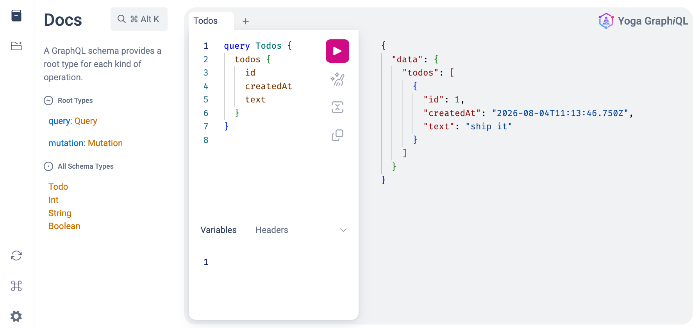

<picture>
  <source media="(prefers-color-scheme: dark)" srcset="https://neon.com/brand/neon-logo-dark-color.svg">
  <source media="(prefers-color-scheme: light)" srcset="https://neon.com/brand/neon-logo-light-color.svg">
  
</picture>

# Getting started with Neon and GraphQL

A minimal [GraphQL](https://graphql.org) API running [GraphQL Yoga](https://the-guild.dev/graphql/yoga-server) on [Hono](https://hono.dev), backed by [Lakebase Postgres](https://neon.com/docs/postgres/overview) and [Drizzle ORM](https://orm.drizzle.team), deployed as a [Neon Function](https://neon.com/docs/compute/functions/overview).

## Project structure

```
with-graphql/
├── neon.ts             # Neon Functions policy (defineConfig) — what gets deployed
├── drizzle.config.ts   # Drizzle Kit config (schema location + DB credentials)
├── tsconfig.json
├── .env.example        # Required environment variables
├── src/
│   ├── index.ts        # Hono app + Yoga GraphQL server (the function entry)
│   ├── env.ts          # DATABASE_URL helper
│   └── db/
│       ├── client.ts   # pg pool + Drizzle
│       └── schema.ts   # todos table
└── package.json
```

## What it does

| Operation | Description |
| --------- | ----------- |
| `Query.todos` | List all todos |
| `Query.todo(id)` | Fetch one todo by id |
| `Mutation.createTodo(text)` | Insert a todo |
| `Mutation.deleteTodo(id)` | Delete a todo by id |

GraphiQL is available at `/graphql` in the browser for interactive exploration.

## Clone the repository

```bash
npx degit neondatabase/examples/with-graphql ./with-graphql
cd with-graphql
```

## Install and authenticate the Neon CLI

```bash
npm i -g neon
neon login
```

## Authenticate the Neon CLI

```bash
neon login
```

## Install dependencies

```bash
npm install
```

## Link your Neon project

Link (or create) a Neon project by running the `link` command from the workspace root:

```bash
neon link
```

If you let your agent drive this, add `--agent` to skip interactive mode.

`neon link` pulls your branch-scoped environment variables — including `DATABASE_URL` — into `.env.local`. You can also find your connection string in the [Neon Console](https://console.neon.tech).

## Apply the schema

Push the Drizzle schema to your Neon database:

```bash
npm run db:generate && npm run db:migrate
```

## Run locally

```bash
neon dev
```

Then in another shell terminal, run the following commands to test the GraphQL API:

```bash
# Health check
curl http://localhost:8787/

# Create a todo
curl -X POST http://localhost:8787/graphql \
  -H 'content-type: application/json' \
  -d '{"query":"mutation { createTodo(text: \"ship it\") { id text createdAt } }"}'

# List todos
curl -X POST http://localhost:8787/graphql \
  -H 'content-type: application/json' \
  -d '{"query":"{ todos { id text createdAt } }"}'

# Get one todo
curl -X POST http://localhost:8787/graphql \
  -H 'content-type: application/json' \
  -d '{"query":"{ todo(id: 1) { id text } }"}'

# Delete a todo
curl -X POST http://localhost:8787/graphql \
  -H 'content-type: application/json' \
  -d '{"query":"mutation { deleteTodo(id: 1) { id } }"}'
```

Or open [http://localhost:8787/graphql](http://localhost:8787/graphql) for GraphiQL.

## Deploy to Neon Functions

Deploy the GraphQL API as a Neon Function to your branch:

```bash
npm run deploy
# equivalent: neon deploy --env .env.local
```

## Test your deployed function

Grab the function's invocation URL and call it:

```bash
# List the function to find its invocation URL
npm run endpoint
# equivalent: neon functions get graphql

# Then call it (replace with your URL)
curl -X POST https://<your-branch>-graphql.compute.<region>.aws.neon.tech/graphql \
  -H 'content-type: application/json' \
  -d '{"query":"{ todos { id text createdAt } }"}'
```

GraphiQL is also available at `https://<your-branch>-graphql.compute.<region>.aws.neon.tech/graphql` in a browser.



> [!IMPORTANT]
> A Neon Function is exposed through a **public HTTPS endpoint, accessible to anyone.**  
> This example is provided as a demo and does not enforce authentication.  
> For production use, ensure you validate a token or API key at the start of the handler before exposing a real GraphQL API.

