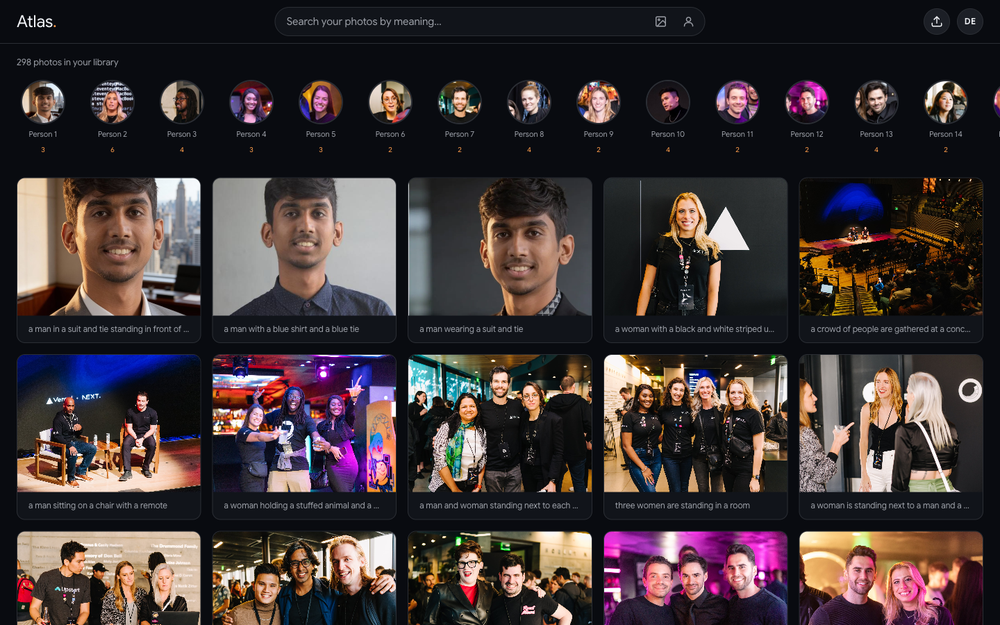
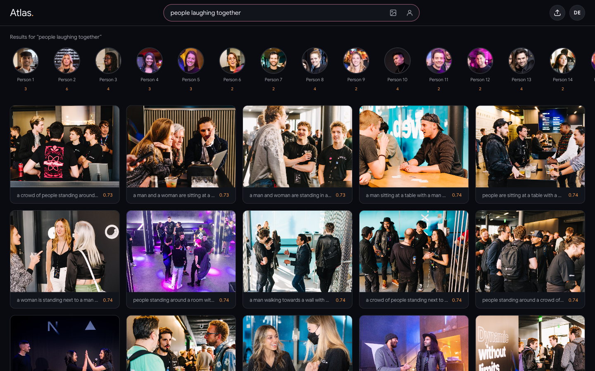
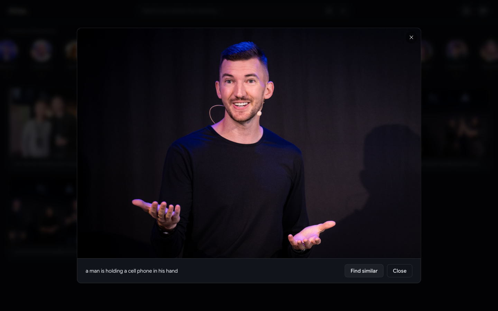
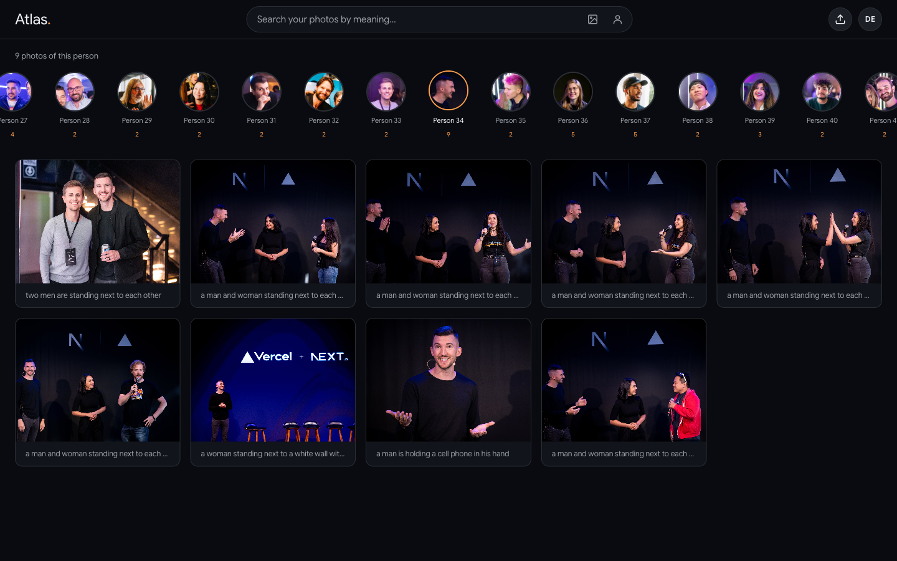

# A private photo library you search by meaning and by face

In Atlas, describe what you remember, like “people laughing together”, drop in an image, or drop in a face to search for similar images in your private photo library. It also automatically groups every face into **people** you can browse by. Every read and write runs through a **backend function that verifies the Neon Auth JWT** and scopes the query to that user (`owner_id = <the verified user>`), so one user never sees another's library.

Built on the Neon backend platform (Postgres, Auth, Lakebase Search, and Object Storage) with [Drizzle ORM](https://orm.drizzle.team), in a single [TanStack Start](https://tanstack.com/start) app on [Vercel](https://vercel.com).

**Live demo** → https://with-tanstack-ai-starter-full-backend.vercel.app



The sign-in page has a one-click **Try the demo account** button, so you can explore the library before setting anything up.

## Try it

### Search by meaning

Type what you remember. The text is embedded with CLIP into the same 512-dimension space as the images, and Lakebase's `lakebase_ann` index returns the nearest photos, ranked, with the similarity score on each result.



### Captions & find similar

Every photo is captioned on upload (ViT-GPT2). Open one and hit **Find similar** to run an image → image search from that photo's own vector. Same SQL, different query vector.



### Search by face & browse People

Faces are detected in the browser and turned into 1024-d descriptors, then grouped into **people** with [Chinese Whispers](<https://en.wikipedia.org/wiki/Chinese_whispers_(clustering_method)>) clustering. Click a face in the People row to see every photo that person appears in, or drop in a new photo of someone to find them across the whole library.



## How it works

```
Browser (TanStack Start SPA)
  │  every server call carries the Neon Auth JWT (Bearer) and the backend verifies it
  │  against the Neon Auth JWKS and scopes each query to owner_id = the token's sub
  │
  ├─ reads  ──►  server functions (createServerFn, src/lib/server/library.ts)
  │              Drizzle over Postgres + lakebase_ann, then presign URLs inline
  │              listPhotos · searchPhotos · neighbors · personPhotos · faceSearch · listPeople
  │
  ├─ faces  ──►  @vladmandic/human runs in the browser (WebGL), so the face
  │              models never touch the server
  │
  └─ /api/*  route handlers for the multipart + model work (same JWT check)
       ├─ embed    CLIP text/image → 512-d vector   (runs in the Vercel Node runtime)
       ├─ upload   embed + store bytes + insert row (owner_id from the JWT)
       ├─ caption  ViT-GPT2 caption for one uploaded photo
       └─ faces    store detected faces + regroup people (Chinese Whispers)
```

The reads go through JWT-checked server functions that query with Drizzle and scope every row to the verified user. The functions also presign the storage URLs before returning, so the client gets ready-to-render cards in one round trip.

What the full Neon platform provides:

- **Neon Auth**: sign-up / sign-in, sessions, and a JWT that carries the user's identity.
- **Lakebase Search + pgvector**: CLIP embeddings ranked by the `lakebase_ann` index, plus a `vector(1024)` column of face descriptors for identity search.
- **Neon Object Storage**: the image bytes and the face crops, served via short-lived presigned URLs.
- **CLIP (`Xenova/clip-vit-base-patch32`) via transformers.js**: free and self-hosted, no embedding API keys.
- **Faces via `@vladmandic/human`**: detection and descriptors in the browser (WebGL).

## Deploy your own

[](https://vercel.com/new/clone?repository-url=https://github.com/neondatabase/examples/tree/main/with-tanstack-ai-starter-full-backend&env=DATABASE_URL,JWKS_URL,AWS_ENDPOINT_URL_S3,AWS_ACCESS_KEY_ID,AWS_SECRET_ACCESS_KEY,AWS_REGION,S3_BUCKET,VITE_NEON_URL,VITE_NEON_AUTH_URL)

After the first deploy, add your production origin to Neon Auth's **trusted origins** so sign-in is accepted from the deployed domain, then run `npm run setup` against your `DATABASE_URL` to build the library (see below). CLIP and the caption model run in Vercel's Node runtime and download their weights to `/tmp` on the first request.

## Setting up locally

### Prerequisites

- Node 22+
- A Neon project (region **us-east-2**) with:
  - Postgres (the `vector`, `lakebase_vector`, and `lakebase_text` extensions are created for you by `npm run setup`)
  - **Neon Auth** enabled
  - a **Neon Object Storage** bucket

### Steps

```bash
cp .env.example .env                 # fill in from your Neon project (see below)
npm install

# One command: creates the extensions, pushes the Drizzle schema (all four tables),
# then rebuilds the whole demo library in YOUR Neon database.
npm run setup

npm run dev                          # http://localhost:3000
```

`npm run setup` creates the demo account and assigns the photos to it, so after it finishes you can sign in with the **Try the demo account** button.

The demo images in `scripts/demo-photos.json` are the Next.js Conf photos, from Vercel's [animated image gallery](https://vercel.com/blog/building-a-fast-animated-image-gallery-with-next-js).

### Regenerating face groups offline

Face detection runs in the browser on upload. The optional offline `npm run faces` script re-embeds every photo's faces in one batch and uses `@tensorflow/tfjs-node`, a heavy native package that is deliberately kept out of `package.json` so it never bloats the Vercel build. The script installs it on demand via a `prefaces` hook (`npm i --no-save`), so just run:

```bash
npm run faces
```

## Tech stack

- Vite
- React 19
- TanStack Start
- Tailwind CSS v4
- `@neondatabase/auth-ui`
- faces via `@vladmandic/human`
- `@neondatabase/neon-js` (Neon Auth)
- Drizzle ORM over `@neondatabase/serverless`
- CLIP and ViT-GPT2 via `@huggingface/transformers`
- Neon Postgres 18 with `lakebase_vector` & `lakebase_text`
- TanStack server functions for the JWT-checked backend reads
